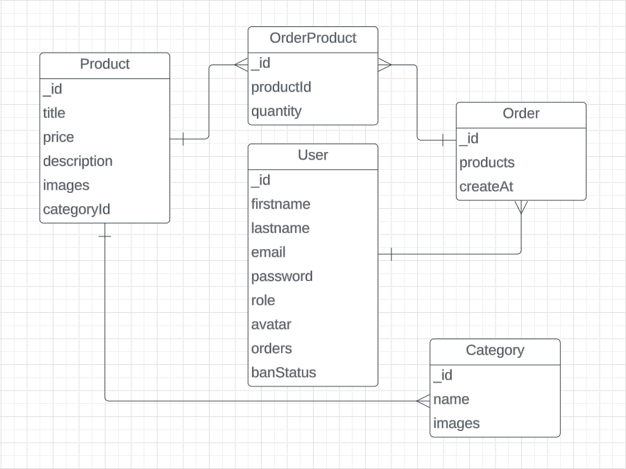

# E-commerce API

A backend application is built using Node.js, Express.js, Mongoose, and TypeScript. This application is designed to handle various CRUD operations related to products, users, orders, and categories. It utilizes MongoDB as its database.

## Table of Contents

1. [Getting Started](#getting-started)
2. [Features](#features)
3. [Technologies Used](#technologies-used)
4. [Project Structure](#project-structure)
5. [Error Handling](#error-handling)
6. [Testing](#testing)
7. [Deployment](#deployment)

## Getting Started

### Prerequisites

Before you begin, ensure you have the following installed:

- Node.js (v18.18.0 or later recommended)
- npm (Node Package Manager) or yarn


### Installation

To get started with the project, follow these steps:

1. Clone the repository: `git clone https://github.com/Kudoo39/e-commerce`
2. Navigate to the project directory: `cd e-commerce`
3. Install dependencies: `npm install` or `yarn install`
4. Run the project: `npm run start` or `yarn start`
5. Run the application in developer mode: `npm run dev`

## Features

The following endpoints are available in the application:

### Products

- GET /products: Get all products.
- GET /products/category/:categoryId: Get products by category.
- POST /products: Create a new product.
- GET /products/:productId: Get a product by ID.
- PUT /products/:productId: Update a product.
- DELETE /products/:productId: Delete a product.

### Users

- GET /users: Get all users.
- POST /users: Register a new user.
- POST /users/login: Login a user.
- PUT /users/:userId: Update a user.
- DELETE /users/:userId: Delete a user.
- POST /users/:userId/ban: Ban a user.
- POST /users/:userId/unban: Unban a user.
- POST /users/password: Request a one-time password for a user.

### Orders

- GET /orders: Get all orders.
- POST /orders/:userId: Create a new order for a user.
- GET /orders/:userId: Get orders for a user.
- PUT /orders/:orderId: Update an order.
- DELETE /orders/:orderId: Delete an order.

### Categories

- GET /categories: Get all categories.
- POST /categories: Create a new category.
- GET /categories/:categoryId: Get a category by ID.
- PUT /categories/:categoryId: Update a category.
- DELETE /categories/:categoryId: Delete a category.

## Error Handling

Errors are handled centrally using custom error classes defined in the `errors/ApiErrors.ts` file. These errors are then caught and processed in the middleware `middlewares/apiErrorhandler.ts`.

### Custom Error Classes

- NotFoundError: Thrown when the requested resource is not found.
- ForbiddenError: Thrown when the user does not have permission to access a resource.
- UnauthorizedError: Thrown when the user is not authenticated to access a resource.
- InternalServerError: Thrown when an unexpected error occurs on the server.
- BadRequest: Thrown when the request is malformed or invalid.
- ConflictError: Thrown when there is a conflict with the current state of the server.

## Technologies Used

- Node.js with Typescript
- Express.js
- Mongoose
- Joi
- nodemon
- bcrypt
- JWT (JSON Web Tokens)
- validator
- jest

## Project Structure

```
src
 ┣ assets
 ┃ ┗ erd.png
 ┣ controllers
 ┃ ┣ categories.ts
 ┃ ┣ orders.ts
 ┃ ┣ products.ts
 ┃ ┗ users.ts
 ┣ errors
 ┃ ┗ ApiError.ts
 ┣ middlewares
 ┃ ┣ adminCheck.ts
 ┃ ┣ apiErrorhandler.ts
 ┃ ┗ verifyJWT.ts
 ┣ misc
 ┃ ┗ type.ts
 ┣ model
 ┃ ┣ Category.ts
 ┃ ┣ Order.ts
 ┃ ┣ OrderProduct.ts
 ┃ ┣ Product.ts
 ┃ ┗ User.ts
 ┣ routers
 ┃ ┣ categoriesRouter.ts
 ┃ ┣ ordersRouter.ts
 ┃ ┣ productsRouter.ts
 ┃ ┗ usersRouter.ts
 ┣ services
 ┃ ┣ categories.ts
 ┃ ┣ orders.ts
 ┃ ┣ products.ts
 ┃ ┗ users.ts
 ┣ validations
 ┃ ┗ userValidation.ts
 ┣ app.ts
 ┗ server.ts
 ```

 ## Entity Relationship Diagram

 

 ## Testing

1. Ensure all dependencies are installed: `npm install` or `yarn install`
2. Run the test suite: `npm run test` or `yarn test`

 ## Deployment

 - The project is deployed using Render: https://fs17-backend.onrender.com/


